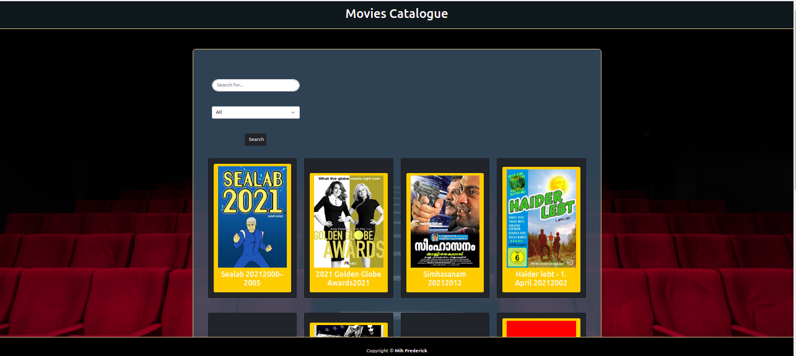
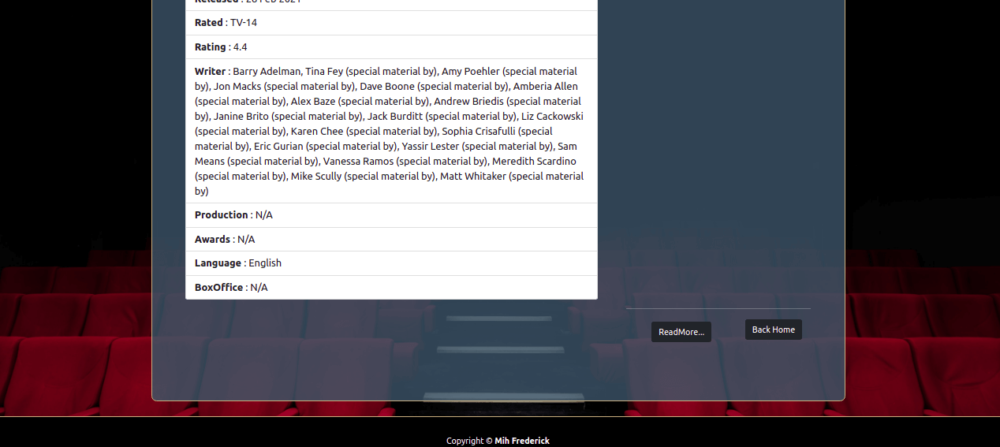

# Catalogue of Statistics

 Catalogue of Statistics is an app that allows you to search for your favorite movie. Users can search for his/her film by entering keywords on the search field or by filtering out films by categories(movies or series). Clicking on a movie image, display the details of the movie on another page.

##### How it looks

## Built With

* React
* Redux
* JavaScript
* HTML5/CSS3
* bootstrap
* https://omdbapi.com/ api

## Deployment

This application is deployed on Heroku

## [Live Link](https://fred-movies-app.herokuapp.com/)

## Getting Started

##### Setup this project locally by following the simple steps bellow.

* Open terminal in the directory where you wish to install the app:
* Run the command `https://github.com/FrederickMih/Movie-Catalogue` to get a local copy of the project
* Switch to the main directory of the project by running `Movie-Catalogue`
* Next, run `npm install` in your terminal to install all the dependencies of the project(NB: you will require Node.js already installed on your computer)
* In order to use the data from the api, you will need to get an api key from `https://omdbapi.com/`.
* Finally, run `npm start` (NB: You will needs a browser installed on your machine).

## Testing

* This project includes 8 Test Suites, 19 Tests cases and 12 Snapshots.
* These tests are implemented uisng Jest, and React testing library.
* To run the tests used the command: `npm run test`

## Author

👤 **Mih Frederick**

## 🤝 Contributing

Contributions, issues, and feature requests are welcome!

## Show your support

Give a ⭐️ if you like this project!

## Acknowledgments

* To Microverse for their `README` template.
* [To OMDB](https://omdbapi.com/) for the API.

## 📝 [License]

MIT License
